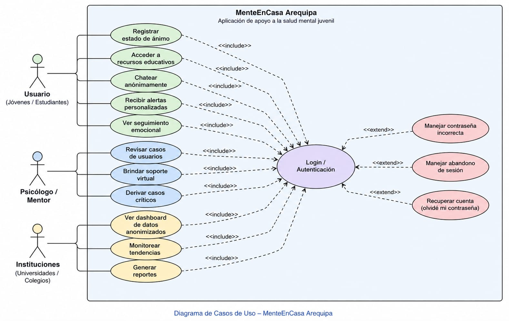
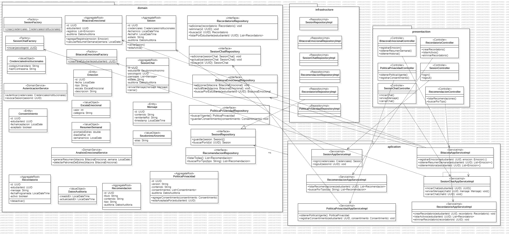

# MenteEnCasa

MenteEnCasa es un proyecto de software orientado al apoyo emocional de estudiantes universitarios. El sistema permite registrar emociones, visualizar el seguimiento emocional y organizar recomendaciones de bienestar.

## Propósito

Brindar una herramienta digital que ayude a los estudiantes a monitorear su estado emocional y detectar patrones relacionados con estrés, ansiedad o bienestar.

## Funcionalidades

### Funcionalidades de alto nivel

- Registro e inicio de sesión de estudiantes (autenticación institucional).
- Seguimiento emocional diario y cálculo de resumen semanal.
- Detección de patrones de estrés a partir del historial emocional.
- Soporte mediante chat anónimo con un psicólogo.
- Recomendaciones personalizadas de bienestar.
- Recordatorios y notificaciones.
- Gestión de consentimientos y política de privacidad.

### Diagrama de Casos de Uso

### Prototipo / GUI

> ⏳ Pendiente de incorporar.

## Modelo de Dominio

El dominio está organizado en seis *bounded contexts* (DDD), cada uno representado como un paquete dentro de `src/domain`:

| Bounded Context | Responsabilidad |
|---|---|
| `BC1_Autenticacion` | Inicio de sesión y validación de credenciales institucionales |
| `BC2_SeguimientoEmocional` | Registro de emociones, bitácora y resumen semanal |
| `BC3_SoporteChat` | Chat anónimo entre estudiante y psicólogo |
| `BC4_Recomendaciones` | Catálogo de recomendaciones de bienestar |
| `BC5_Notificaciones` | Recordatorios programados |
| `BC6_PrivacidadSeguridad` | Política de privacidad y consentimientos |

### Diagrama de Clases

## Vista General de Arquitectura

El proyecto sigue una arquitectura en capas:

- **`presentation`**: controllers, punto de entrada del sistema.
- **`application`**: orquesta los casos de uso (*AppServiceImpl*), sin contener reglas de negocio.
- **`domain`**: entidades, value objects, factories, domain services y repositorios (interfaces). No depende de ninguna otra capa.
- **`infrastructure`**: implementaciones concretas de los repositorios (persistencia).

La dependencia siempre apunta hacia `domain`: `presentation` depende de `application`, `application` depende de `domain`, e `infrastructure` implementa las interfaces que `domain` define.

### Diagrama de Paquetes y Clases

El mismo diagrama de dominio muestra también la distribución en los cuatro paquetes (`domain`, `application`, `infrastructure`, `presentation`) y las clases dentro de cada uno:

## Tablero Kanban/Scrum

El tablero de gestión del proyecto se documentará en:

- docs/trello.md
