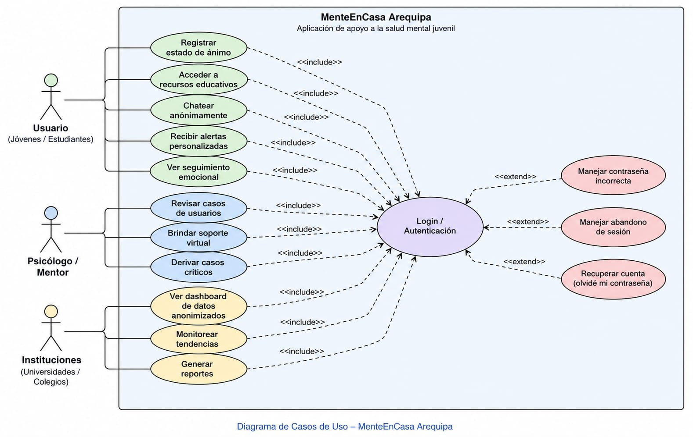
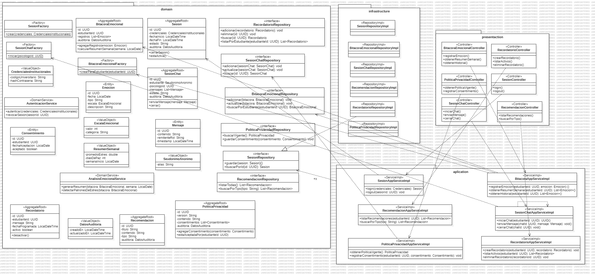

# MenteEnCasa

MenteEnCasa es un proyecto de software orientado al apoyo emocional de estudiantes universitarios. El sistema permite registrar emociones, visualizar el seguimiento emocional y organizar recomendaciones de bienestar.

**Curso:** Ingeniería de Software I — Proyecto Final 2026-B
**Docente:** Edgar Sarmiento Calisaya

## Índice

1. [Equipo de trabajo](#equipo-de-trabajo)
2. [Propósito del proyecto](#propósito-del-proyecto)
3. [Funcionalidades](#funcionalidades)
4. [Modelo de Dominio](#modelo-de-dominio)
5. [Visión General de Arquitectura](#visión-general-de-arquitectura)
6. [Prácticas de Desarrollo Aplicadas](#prácticas-de-desarrollo-aplicadas)
7. [Gestión de Proyecto (Trello)](#gestión-de-proyecto-trello)
8. [Flujo de Git y Ramas](#flujo-de-git-y-ramas)

---

## Equipo de trabajo

| Integrante | Bounded Context (Módulo) | Responsabilidad principal |
|---|---|---|
| Ramos Mamani, Rodrigo Abraham | BC1 – Autenticación | Inicio de sesión y validación de credenciales institucionales |
| Gama Llicahua, Fernando Antonio | BC2 – Seguimiento Emocional | Registro de emociones, bitácora y resumen semanal |
| Huamani Sabina, Johan Diego | BC3 – Soporte Chat | Chat anónimo entre estudiante y psicólogo |
| Villanueva Flores, Diego Mauricio | BC4 – Recomendaciones | Catálogo de recomendaciones de bienestar |
| Canqui Ecos, Diego | BC5 – Notificaciones | Recordatorios programados |

> El módulo **BC6 – Privacidad y Seguridad** (política de privacidad y consentimientos) no fue asignado a un integrante específico y se encuentra pendiente de desarrollo.

## Propósito del proyecto

Brindar una herramienta digital que ayude a los estudiantes a monitorear su estado emocional y detectar patrones relacionados con estrés, ansiedad o bienestar.

## Funcionalidades

### Funcionalidades de alto nivel (Casos de Uso)

- Registro e inicio de sesión de estudiantes (autenticación institucional).
- Seguimiento emocional diario y cálculo de resumen semanal.
- Detección de patrones de estrés a partir del historial emocional.
- Soporte mediante chat anónimo con un psicólogo.
- Recomendaciones personalizadas de bienestar.
- Recordatorios y notificaciones.
- Gestión de consentimientos y política de privacidad.

### Diagrama de Casos de Uso



### Prototipo / GUI

> ⏳ Pendiente de incorporar.

## Modelo de Dominio

El dominio está organizado en seis *bounded contexts* (DDD), cada uno representado como un paquete dentro de `src/domain`:

| Bounded Context | Responsabilidad |
|---|---|
| `BC1_Autenticacion` | Inicio de sesión y validación de credenciales institucionales |
| `BC2_SeguimientoEmocional` | Registro de emociones, bitácora y resumen semanal |
| `BC3_SoporteChat` | Chat anónimo entre estudiante y psicólogo |
| `BC4_Recomendaciones` | Catálogo de recomendaciones de bienestar |
| `BC5_Notificaciones` | Recordatorios programados |
| `BC6_PrivacidadSeguridad` | Política de privacidad y consentimientos |

### Diagrama de Clases



## Visión General de Arquitectura

El proyecto sigue **Domain-Driven Design** organizado en una **arquitectura en capas**:

- **`presentation`**: controllers, punto de entrada del sistema.
- **`application`**: orquesta los casos de uso (*AppServiceImpl*), sin contener reglas de negocio.
- **`domain`**: entidades, value objects, factories, domain services y repositorios (interfaces). No depende de ninguna otra capa.
- **`infrastructure`**: implementaciones concretas de los repositorios (persistencia).

La dependencia siempre apunta hacia `domain`: `presentation` depende de `application`, `application` depende de `domain`, e `infrastructure` implementa las interfaces que `domain` define (**Inversión de Dependencias**).

### Diagrama de Paquetes y Clases


---

## Prácticas de Desarrollo Aplicadas

A continuación se documentan, con fragmentos de código reales del repositorio, las prácticas de desarrollo aplicadas en el proyecto.

### 1. Domain-Driven Design (DDD)

**Entidades** — objetos con identidad propia que cambian de estado a lo largo del tiempo, como `Recordatorio` (BC5):

```java
public class Recordatorio {
    private final UUID id;
    private final UUID estudianteId;
    private final String mensaje;
    private final LocalDateTime fechaProgramada;
    private boolean activo;

    public void desactivar() {
        this.activo = false;
    }
}
```

**Value Objects** — objetos inmutables definidos por su valor, no por identidad, como `CredencialesInstitucionales` (BC1), que se autovalida en el constructor:

```java
public CredencialesInstitucionales(String codigoUniversitario, String hashContrasena) {
    if (codigoUniversitario == null || codigoUniversitario.isBlank()) {
        throw new IllegalArgumentException("El código universitario no puede estar vacío.");
    }
    ...
}
```

**Factories** — encapsulan la creación válida de entidades, ocultando su constructor de uso libre. Ejemplo, `SesionFactory` (BC1):

```java
public class SesionFactory {
    private SesionFactory() { } // Constructor privado, la clase solo expone el método estático

    public static Sesion registrarSesion(String codigoUsuario) {
        return new Sesion(codigoUsuario);
    }
}
```

**Aggregate Root** — `ChatSession` (BC3) es la raíz de agregado que controla el ciclo de vida de sus `Message` internos; ninguna otra clase puede modificarlos directamente.

**Repositories (interfaces en el dominio)** — el dominio define el contrato, sin saber cómo se persiste. Ejemplo, `ChatSessionRepository` (BC3), implementado en `infrastructure` por `InMemoryChatSessionRepository`.

### 2. Principios SOLID

**Inversión de Dependencias (DIP)** — la capa de aplicación depende de la *interfaz* del repositorio, nunca de su implementación concreta:

```java
public class ChatSessionAppServiceImpl implements ChatSessionAppService {
    private final ChatSessionRepository repository; // interfaz, no implementación

    public ChatSessionAppServiceImpl(ChatSessionRepository repository) {
        this.repository = Objects.requireNonNull(repository, "El repositorio de chat es obligatorio");
    }
}
```

**Segregación de Interfaces (ISP)** — `ChatSessionAppService` expone solo los métodos que sus clientes necesitan, sin operaciones ajenas a su responsabilidad:

```java
public interface ChatSessionAppService {
    UUID startChat(StartChatRequest request);
    void sendMessage(SendMessageRequest request);
    void closeChat(UUID chatId);
    ChatSession getChat(UUID chatId);
}
```

**Responsabilidad Única (SRP)** — cada `Factory` tiene una única razón para cambiar: crear instancias válidas de su entidad (`SesionFactory`, `ChatSessionFactory`). La lógica de negocio de `Recordatorio` está separada del contrato de persistencia `RecordatorioRepository` (BC5).

**Abierto/Cerrado (OCP)** — al depender de `RecordatorioRepository` como puerto abstracto, se puede cambiar el motor de persistencia (memoria, PostgreSQL, MongoDB) sin modificar el dominio.

### 3. Codificación Limpia (Clean Code)

- **Nombres con sentido**: `estudianteId`, `fechaProgramada`, `codigoUniversitario` — expresan la intención de negocio sin abreviaturas.
- **Funciones atómicas**: métodos pequeños con una sola tarea, como `desactivar()` en `Recordatorio` y `Sesion`.
- **Validaciones tempranas / guard clauses**: uso de `Objects.requireNonNull(...)` al inicio de constructores y métodos públicos para fallar rápido ante datos inválidos.
- **Uso de `Optional` en vez de `null` sueltos**, por ejemplo en `AutenticacionService.iniciarSesion(...)`, que retorna `Optional<Sesion>`.
- **Inmutabilidad**: atributos `final` en entidades y value objects; colecciones expuestas como no modificables, ej. `BitacoraEmocional.getRegistros()` devuelve `Collections.unmodifiableList(registros)`.
- **Encapsulación**: atributos privados con accesores (getters), sin exponer estado interno directamente.
- **Documentación útil**: Javadoc explicando el propósito de negocio en interfaces públicas y clases de dominio.

### 4. Convenciones de Codificación (Java / SonarLint)

- Nombres de clases en `PascalCase` y de variables/métodos en `camelCase` en todo el proyecto.
- Identificadores únicos globales con `UUID` en vez de IDs autoincrementales.
- **Imports explícitos**, evitando comodines (`import java.util.*`) en el código de dominio activo.
- Constructores privados para ocultar el constructor público implícito en clases de utilidad estáticas (regla SonarLint S1118), aplicado en `SesionFactory`.

### 5. Estilos de Programación

| Estilo | Dónde se aplica |
|---|---|
| **Things (Objetos)** | Encapsulación de estado y comportamiento en entidades como `Recordatorio` y `Sesion`. |
| **Cookbook** | `BitacoraEmocional` (BC2): el cálculo del resumen semanal se expresa como una secuencia de pasos privados que leen y modifican estado compartido de la instancia, documentado explícitamente en el Javadoc de la clase. |
| **Pipeline** | `AutenticacionService.obtenerSesionesActivasPorUsuario(...)` (BC1): procesamiento declarativo con Streams — `stream().filter(...).filter(...).toList()`. |
| **Persistent Tables** | Contratos de repositorio orientados a operaciones CRUD sobre modelos estructurados, ej. `RecordatorioRepository` (`adicionar`, `eliminar`, `buscar`, `listarPorEstudiante`). |
| **Error Handling** | Validaciones defensivas en la frontera del sistema con `Objects.requireNonNull(...)` y excepciones específicas de dominio (ej. `AutenticacionException`), evitando propagar estados inválidos. |

---

## Gestión de Proyecto (Trello)

El proyecto se gestiona mediante un tablero que combina **User Story Mapping** (columnas por épica funcional) con flujo **Kanban** (`EN PROGRESO` → `En Revisión` → `COMPLETADO`).

🔗 **[Ver tablero en Trello](https://trello.com/invite/b/6a0747195cb3e1bd3f9a9bcb/ATTI3aa37b3e8b3f9ab43870e581bd47fa3dE6E87ADC/mi-tablero-de-trello)**

> 📸 *Captura de pantalla pendiente de incorporar.*

Detalle completo de columnas, épicas y backlog en [`docs/trello.md`](docs/trello.md).

## Flujo de Git y Ramas

- `master` — código estable listo para presentación.
- `desarrollo` — integración de los módulos antes de pasar a `master`.
- `BCx_NombreModulo` — una rama de feature por bounded context, mergeada según el avance de cada integrante.

Flujo de integración: `feature → desarrollo → master`.
